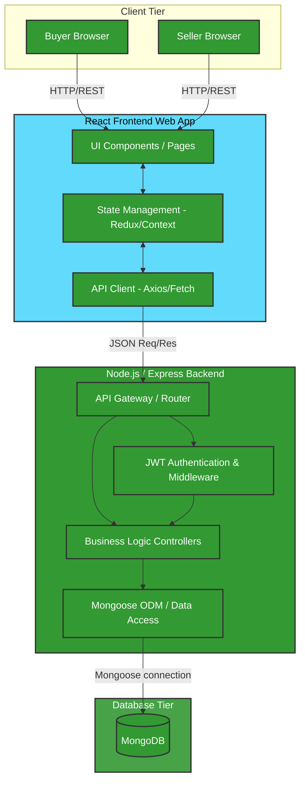

# RevShop Application Architecture

This diagram shows the modular/layered design of our scalable MERN application. The boundaries shown below easily allow for splitting out individual components into a microservices architecture in the future.

## Layered Design Details
- **Presentation Layer (Frontend)**: React components for visual rendering.
- **Application Layer (Backend Server)**: Express server handling the HTTP requests, routing, and middleware logic such as authentication.
- **Business Logic Layer (Controllers)**: Processing core operations (e.g., placing orders, validating threshold levels, taking payments).
- **Data Access Layer (Models)**: Mongoose schemas interacting with the physical database, creating an abstraction over raw MongoDB queries. 
- **Data Layer (Database)**: The persistent MongoDB storage.
