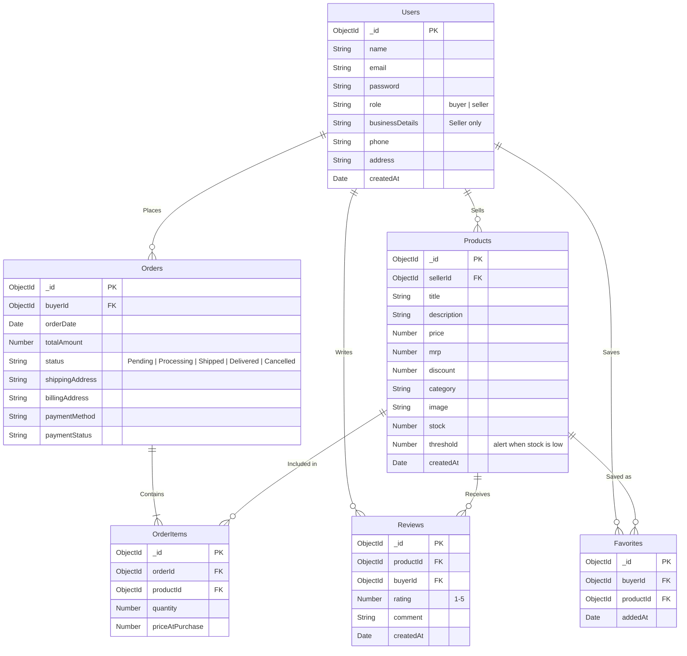

# RevShop Entity Relationship Diagram

```mermaid
erDiagram
    Users {
        ObjectId _id PK
        String name
        String email
        String password
        String role "buyer | seller"
        String businessDetails "Seller only"
        String phone
        String address
        Date createdAt
    }
    
    Products {
         ObjectId _id PK
         ObjectId sellerId FK
         String title
         String description
         Number price
         Number mrp
         Number discount
         String category
         String image
         Number stock
         Number threshold "alert when stock is low"
         Date createdAt
    }
    
    Orders {
        ObjectId _id PK
        ObjectId buyerId FK
        Date orderDate
        Number totalAmount
        String status "Pending | Processing | Shipped | Delivered | Cancelled"
        String shippingAddress
        String billingAddress
        String paymentMethod
        String paymentStatus
    }
    
    OrderItems {
        ObjectId _id PK
        ObjectId orderId FK
        ObjectId productId FK
        Number quantity
        Number priceAtPurchase
    }
    
    Reviews {
        ObjectId _id PK
        ObjectId productId FK
        ObjectId buyerId FK
        Number rating "1-5"
        String comment
        Date createdAt
    }
    
    Favorites {
        ObjectId _id PK
        ObjectId buyerId FK
        ObjectId productId FK
        Date addedAt
    }
    
    Users ||--o{ Products : "Sells"
    Users ||--o{ Orders : "Places"
    Orders ||--|{ OrderItems : "Contains"
    Products ||--o{ OrderItems : "Included in"
    Users ||--o{ Reviews : "Writes"
    Products ||--o{ Reviews : "Receives"
    Users ||--o{ Favorites : "Saves"
    Products ||--o{ Favorites : "Saved as"
```
